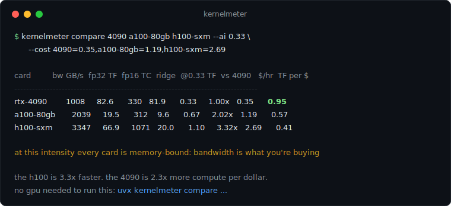

# kernelmeter

[](https://pypi.org/project/kernelmeter/)
[](https://github.com/nuemaan/kernelmeter/actions/workflows/ci.yml)
[](https://pypi.org/project/kernelmeter/)
[](LICENSE)



Try that right now, no install and no GPU required:

```bash
uvx kernelmeter compare 4090 a100-80gb h100-sxm --ai 0.33
```

Or skip the terminal entirely: **[nuemaan.github.io/kernelmeter](https://nuemaan.github.io/kernelmeter/)**
runs the comparison in your browser, and the settings live in the URL so
you can send someone the exact tradeoff you mean.

Small tools for two questions: **is my GPU kernel actually good, and
which GPU is actually worth paying for?** All in one package with zero
required dependencies.

* `kernelmeter info` prints every device attribute your GPU driver knows,
  plus the card's theoretical peak bandwidth and FP32 throughput. No CUDA
  toolkit, no torch, no kernel launch. It reads straight from `libcuda`,
  which is part of the NVIDIA driver.
* `kernelmeter bench` times your kernel, checks the output against a
  reference, and scores it against the roofline: the best your card could
  possibly do for that kernel's mix of math and memory traffic. 240 GB/s
  means nothing on its own; "76% of attainable" tells you how much room
  is left. While the kernel runs it also samples the real clocks, power
  and temperature through NVML, and re-scores against the ceiling the
  card actually held.
* `kernelmeter roofline` draws your card's roofline in the terminal and
  shows where a kernel sits on it.
* `kernelmeter occupancy` answers "why is my occupancy 50%?" from block
  size, registers and shared memory, and shows which block sizes fix it.
* `kernelmeter ceiling` measures what the card *really* delivers
  (STREAM-style bandwidth tests plus a big FP32 matmul), because spec
  sheet numbers are never fully reachable.
* `kernelmeter compare 4090 h100-sxm --ai 0.33` tells you which card is
  actually faster *for your kernel*, and per rental dollar. Works with
  no GPU at all: there is a built-in database of 31 cards whose specs
  are unit-tested against the vendor sheets.
* `kernelmeter llm 70b --quant q4 --gpus 4090 a100-80gb` answers the
  question everyone actually has: does it fit, and what is the hard
  ceiling on tokens per second. Same roofline math, zero benchmarks.
* `kernelmeter report` writes a single-file HTML report card for your
  GPU that you can share, attach to an issue, or keep as a record.

## Install

```bash
pip install kernelmeter           # info only, no dependencies
pip install "kernelmeter[bench]"  # adds torch for the bench harness
```

Or from source:

```bash
git clone https://github.com/nuemaan/kernelmeter
cd kernelmeter
pip install -e ".[bench]"
```

## No GPU handy? Start here

Deciding what to rent is a roofline question, and you can answer it from
any laptop. Say your kernel does 0.33 flop per byte (a fused elementwise
op) and you're choosing between renting cards:

```bash
kernelmeter compare 4090 a100-80gb h100-sxm --ai 0.33 --cost 4090=0.35,a100-80gb=1.19,h100-sxm=2.69
```

```text
card            bw GB/s  fp32 TF  fp16 TC  ridge  @0.33 TF  vs rtx-4090   $/hr  TF per $
----------------------------------------------------------------------------------------
rtx-4090           1008     82.6      330   81.9      0.33        1.00x   0.35      0.95
a100-80gb          2039     19.5      312    9.6      0.67        2.02x   1.19      0.57
h100-sxm           3347     66.9     1071   20.0      1.10        3.32x   2.69      0.41

at this intensity every card is memory-bound: bandwidth is what you're buying
```

Read the last two columns: the H100 is 3.3x faster in absolute terms, but
for this kernel the 4090 delivers more than twice the throughput per
rental dollar. The overlaid rooflines print below the table so you can
see *why*: left of every ridge point, only the bandwidth line matters.

`kernelmeter gpus` lists the built-in database (T4 through RTX 5090,
A100/H100 and the workstation cards). Every entry stores physical
parameters and derives its peaks through the same formulas used for live
devices, and the test suite asserts each derived number against the
vendor spec sheet, so a wrong entry fails CI. `kernelmeter roofline
--gpu 4090` draws any card's roofline the same way.

## Will it run a 70B, and how fast at best?

LLM decode is the memory-bound case of the same roofline: generating one
token reads every weight once, so the hard ceiling is bandwidth divided
by weight bytes. Prefill is the compute-bound case, about 2 FLOPs per
parameter per token. That means honest upper bounds need no benchmark at
all:

```bash
kernelmeter llm 70b --quant q4 --gpus 4090 a100-80gb h100-sxm --cost a100-80gb=1.19,h100-sxm=2.69
```

```text
70b model at q4 (~0.58 bytes/param): 40.6 GB of weights

card                         vram  fits  decode t/s  prefill t/s   $/hr  t/s per $
----------------------------------------------------------------------------------
rtx-4090                     24GB    no           -            -      -          -
a100-80gb                    80GB   yes          50         2228   1.19       42.2
h100-sxm                     80GB   yes          82         7647   2.69       30.6

these are roofline ceilings, not predictions: well-tuned stacks land at 50-85%
of them, none land above. kv cache and activations need room on top of the
weights (2 GB per gpu assumed here).
geforce/titan prefill uses the fp32-accumulate tensor rate (half the fp16 peak).
```

The honesty note is the point. If someone quotes you 120 tok/s for a 70B
q4 on one A100, the ceiling says that's physically impossible; if your
own stack gets 20, the ceiling says you're leaving half on the table.
Quant sizes use effective bytes per parameter (gguf k-quants carry
scales, so q4 is ~0.58, not 0.5); pass `--bytes-per-param` for an exact
figure. With no `--gpus` it estimates for the GPU in your machine, using
its real memory size for the fit check.

It also handles the setups people actually run:

* `--num-gpus 2` models the classic budget rig. Two 3090s hold a 70B q4
  that one can't, at a ~46 t/s ceiling, and at rental prices they come
  out around 2.5x the tokens per dollar of an A100 pair.
* `--active-params 37b` handles MoE models: fit needs the full weights,
  but each token only reads the active experts, which is why a 671B
  DeepSeek decodes faster than a dense 70B on the same hardware.
* `--batch 32` shows throughput ceilings: weight reads amortize across
  concurrent streams until the compute roof takes over, and the table
  splits total t/s from per-stream t/s. The crossover batch size is the
  ridge point again, just wearing different clothes.
* `--per-watt` adds a tokens-per-watt column from the cards' TDP.

GeForce and Titan prefill ceilings use the fp32-accumulate tensor rate,
half the marketing fp16 number, because that is what inference stacks
actually do. Datacenter cards run full rate either way.

## Querying your GPU

```bash
kernelmeter info
```

Output from a Tesla T4:

```text
CUDA driver version : 13.0

Device 0: Tesla T4 (14.6 GiB)
  compute capability        : 7.5
  theoretical mem bandwidth : 320.1 GB/s
  theoretical FP32 peak     : 8.14 TFLOP/s
  theoretical fp16 tensor   : 65.13 TFLOP/s (dense)
  architecture (nvml)       : Turing, 2560 CUDA cores
  pcie link (nvml)          : gen1/3 x8/16
  memory in use (nvml)      : 450 / 15360 MiB
  ecc (nvml)                : on
  vbios (nvml)              : 90.04.96.00.02

  attribute                                        value
  ------------------------------------------------ ------------
  max_threads_per_block                            1024
  max_block_dim_x                                  1024
  max_shared_memory_per_block                      49152
  warp_size                                        32
  clock_rate_khz                                   1590000
  ...                                              (147 attributes total)
```

The `attribute` table is read straight from the driver via
`cuDeviceGetAttribute`, the same values Nsight Compute shows as
`device__attribute_*`, but you don't need to profile a kernel to see them.
Every id is probed live, so the output matches the machine you run it on;
ids newer than the bundled name table show up as `attribute_<id>`.

The `(nvml)` lines come from a second source: NVML, the library behind
`nvidia-smi`, also shipped with the driver. They surface facts the driver
attribute enum doesn't have (architecture name, real CUDA core count,
PCIe link, live memory use, ECC, VBIOS) and are skipped silently if NVML
isn't present. (The `gen1/3 x8/16` above is the live link: an idle T4
drops to a lower PCIe state and ramps up under load.) Add `--json` for
machine-readable output; the NVML block lands under `devices[].nvml`.

## Benchmarking a kernel

Three steps.

**1. Write your kernel in a file and decorate it.** Anything callable from
Python works: Triton kernels, custom CUDA extensions, `torch.compile`
output, CuPy. Here is a complete file you can copy:

```python
# mybench.py
import torch
import kernelmeter as km

N = 1 << 26  # work on big inputs so you measure memory, not cache

def make_args():
    return (torch.randn(N, device="cuda"), torch.randn(N, device="cuda"))

@km.benchmark(
    "my_add",
    args=make_args,                 # builds fresh inputs for the run
    ref=torch.add,                  # trusted implementation to compare with
    bytes_per_call=lambda x, y: 3 * x.numel() * x.element_size(),
)
def my_add(x, y):
    return x + y                    # <- replace with your kernel
```

`bytes_per_call` is how much memory the algorithm has to move (here: read
x, read y, write the result). The tool divides it by measured time to get
your effective bandwidth.

**2. Run it.**

```bash
kernelmeter bench mybench.py
```

**3. Read the result.** From a T4, with the add written as a Triton kernel:

```text
kernel                    median ms      GB/s   TFLOP/s  bound    %roof   vs ref  correct
------------------------------------------------------------------------------------------
my_add                       3.2725     246.1         -    mem    76.9%    1.03x     PASS
```

* **correct** - your output matched the reference. If this says FAIL,
  nothing else on the line matters.
* **bound** - whether the memory system (`mem`) or the ALUs (`comp`) limit
  this kernel, decided by its arithmetic intensity (flops per byte).
* **%roof** - how close you are to the best this card could possibly do
  for that intensity. This is the score to improve. Above ~80% there is
  little left to win.
* **vs ref** - speedup over the reference implementation.

Pass `flops_per_call` too and the roofline model places your kernel
precisely; pass `peak_tflops=...` if your kernel runs on tensor cores so
it gets judged against the right ceiling (`kernelmeter info` prints the
derived fp16/tf32 tensor peaks for your card). Raw `%peak bw` and
`%fp32` numbers are always in the `--json` output.

When NVML is available, a second table follows with what the card was
doing during each measurement:

```text
telemetry                    sm MHz   mem MHz   temp   power  %roof@clk
-----------------------------------------------------------------------
my_add                    1062/1590      5000    42C   53.1W      76.9%
```

`%roof@clk` is the same roofline score, but against the ceiling at the
clocks the card actually held. If `%roof` looks bad but `%roof@clk` is
high, your kernel is fine: the card is thermal or power limited, and no
amount of kernel work will change that. A real example, cuBLAS fp32
matmul on a 70 W T4:

```text
kernel                    median ms      GB/s   TFLOP/s  bound   %roof   vs ref  correct
----------------------------------------------------------------------------------------
fp32_matmul                 32.0354       6.3      4.29   comp   52.7%        -        -

telemetry                    sm MHz   mem MHz   temp   power  %roof@clk
-----------------------------------------------------------------------
fp32_matmul                877/1590      5000    46C   70.4W      95.5%
```

53% of peak looks like a kernel problem. The telemetry shows it is not:
the card hit its 70 W power limit and dropped to 877 MHz, and at those
clocks the kernel was at 95.5% of what the silicon could deliver. cuBLAS
was never the problem.

Timing uses CUDA events with warmup, and the L2 cache is flushed between
iterations so small workloads can't fake huge bandwidth numbers from
cache hits. Pass `--no-flush-l2` if you want cache-hot numbers.

The [examples](examples/) folder has ready-to-run starting points: two
Triton kernels (vector add, fused softmax) and a compute-bound matmul.

## Seeing the roofline

```bash
kernelmeter roofline --ai 0.33        # mark a kernel at 0.33 flop/byte
```

```text
Device 0: Tesla T4
  peak bandwidth : 320.1 GB/s
  peak compute   : 8.14 TFLOP/s (fp32)
  ridge point    : 25.4 flop/byte

8.14 TF/s |                                      **x*****************
          |                                   ***
          |                               ****
          |                            ***
          |                        ****
          |                    ****
          |                 ***
          |             ****
          |          ***
          |      *o**
          |  ****
          |**
          +----------------------------------------------------------
           2^-3            2^0            2^3             2^6          flop/byte

at 0.33 flop/byte the kernel is memory-bound; attainable: 0.11 TFLOP/s
```

The `o` is your kernel, the `x` is the ridge point. Left of the ridge,
more FLOPs are free: the memory traffic is the bill you are paying
anyway. That is the whole argument for kernel fusion, in one picture.
No GPU around? `--peak-bw` and `--peak-tflops` let you draw any card.
`--tensor` swaps in the fp16 tensor-core roof, which moves the ridge
point far to the left; that picture explains why tensor-core kernels
are almost always memory-bound.

## Why is my occupancy low?

Feed it what `ptxas -v` or Nsight Compute tells you about your kernel:

```bash
kernelmeter occupancy --block 256 --regs 64 --smem 8192 --cc 8.6
```

```text
occupancy for compute capability 8.6
  block=256 regs/thread=64 smem/block=8192

  occupancy    : 66.7% (32/48 warps per SM)
  blocks per SM: 4
  limited by   : registers

  block size      64    128    192    256    384    512    768   1024
  occupancy      46%    67%    62%    67%    50%    67%    50%    67%
```

It names the resource that is capping you and sweeps block sizes so you
can see if a different launch shape helps. Works with no GPU present:
pass `--cc` for any architecture from 7.0 (Volta) to 12.x (Blackwell).

## What can the card really do?

Theoretical peaks assume the max boost clock, which the card cannot hold.
Measure the real ceilings once and judge your kernels against those:

```bash
kernelmeter ceiling
```

This runs the four STREAM kernels (copy, scale, add, triad) and a large
TF32-disabled matmul. On the same T4:

```text
test            median ms      GB/s   TFLOP/s  % of theoretical
---------------------------------------------------------------
copy               1.1495     233.5         -             73.0%
scale              1.1674     230.0         -             71.8%
add                1.6903     238.2         -             74.4%
triad              1.6878     238.6         -             74.5%
fp32 matmul        3.5563         -      4.83             59.3%

measured bandwidth ceiling: 238.6 GB/s (use this as the honest 100%
for memory-bound kernels)
```

This reframes the bench results above: the vector add that scored "76.9%
of theoretical" was moving 246 GB/s on a card whose memory system tops
out at 238.6 GB/s in practice. It was already saturated. Without the
measured ceiling you would have kept optimizing a finished kernel.

## Catching regressions

```bash
kernelmeter bench mykernels.py --save baseline.json
# ...edit your kernels...
kernelmeter bench mykernels.py --compare baseline.json
```

The compare run prints a delta column per kernel and exits non-zero if
anything got more than 5% slower, so it slots straight into CI.

## A report you can share

```bash
kernelmeter report                 # from the local device
kernelmeter report --gpu 4090      # from the card database
```

Writes a single self-contained HTML file: the card's peak numbers as
tiles, an SVG roofline, the NVML facts and the launch limits. No
javascript, no external assets, dark theme. Attach it to a bug report,
drop it in your team wiki, or keep one per machine in your cluster docs.

## A workflow that works

If you are learning CUDA (say, working through the PMPP book) and wondering
whether your kernels are any good:

1. Run `kernelmeter info` and `kernelmeter ceiling` once. Now you know
   your card's real limits.
2. Benchmark your kernel with `bytes_per_call` and `flops_per_call` set.
   The `bound` column tells you which resource you are fighting.
3. `%roof` under ~60%? If the kernel is memory-bound, check `occupancy`
   first: too few warps in flight cannot hide memory latency. Then open
   Nsight Compute. Now you know what you are looking for, instead of
   staring at forty unfamiliar counters.
4. `%roof` above ~80%? Stop optimizing this kernel. The next win is
   algorithmic (fuse it with a neighbor, move less data), and the
   roofline chart shows why: left of the ridge, FLOPs are free.

## Caveats

* Theoretical peaks are computed from the max boost clock the driver
  reports. Sustained clocks under load are lower; the telemetry table
  and `kernelmeter ceiling` both show what you can actually reach.
* The tensor-core peaks are dense rates with fp16 accumulate. GeForce
  cards run tensor cores at half rate when accumulating in fp32, and
  sparse rates are double; pass `peak_tflops=...` when those apply.
* The occupancy command implements the standard calculator model. Real
  occupancy can differ (launch bounds, driver decisions); confirm with
  Nsight Compute when it matters.
* The attribute name table tracks the CUDA 13.x driver enum. Values are
  always read live from your driver, and ids newer than the table show up
  as `attribute_<id>` rather than being dropped. PRs that extend the
  table when new toolkits land are welcome.

## Development

```bash
pip install -e ".[dev]"
pytest
```

The tests fake the driver, so they run anywhere, no GPU needed. CI runs
them on plain GitHub runners. For an end-to-end check on a real GPU there
is a [Modal](https://modal.com) script: `modal run scripts/modal_gpu_test.py`.
The numbers in this README come from that script on a T4.

Releases are tag-driven: bump the version in `pyproject.toml`, add a
[CHANGELOG.md](CHANGELOG.md) entry, push a `v*` tag. CI tests, builds and
publishes to PyPI through trusted publishing.

## License

MIT
